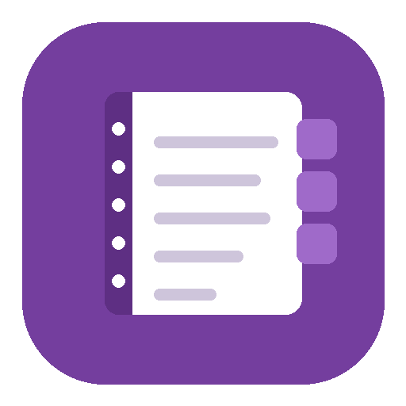

<div align="center">



# OneNote for Claude

**Talk to your OneNote notebooks.**
Search your notes, pull action items out of meeting minutes, or write a new page — without leaving the conversation.

[Install](#install) · [What you can ask](#what-you-can-ask) · [Privacy](#your-privacy) · [Troubleshooting](#troubleshooting)

</div>

---

```
You   What did I write about the Q3 roadmap?
Claude Found "Q3 Planning" in your Work notebook, updated July 12.
       You listed three priorities: ship the beta, hire a designer,
       and move billing off the legacy system...

You   Add a note that the beta slipped to September.
Claude Added to "Q3 Planning".
```

## Install

### Claude Desktop

1. **[Download the latest release](https://github.com/JonEricDelaCruz/onenote-mcp/releases/latest)** — the file ending in `.mcpb`
2. **Double-click it.** Claude Desktop installs it.
3. Ask Claude: *"List my OneNote notebooks."* A browser window opens to sign in to Microsoft.

That's it. No terminal, nothing else to install.

> If double-clicking does nothing, open Claude Desktop → Settings → Extensions, and drag the file onto that window.

### Cursor, Windsurf, VS Code, and others

Add this to your MCP settings:

```json
{
  "mcpServers": {
    "onenote": {
      "command": "npx",
      "args": ["-y", "@joneericdelacruz/onenote-mcp"]
    }
  }
}
```

Restart the app, then ask it to list your notebooks.

<details>
<summary><b>Prefer to run from source?</b></summary>

Requires [Node.js](https://nodejs.org) 20 or newer.

```bash
git clone https://github.com/JonEricDelaCruz/onenote-mcp.git
cd onenote-mcp
npm install
npm run setup
```

`npm run setup` signs you in and configures your AI app automatically — it finds the config file, backs it up, and adds this server without disturbing anything else you have configured.

</details>

## What you can ask

Anything you'd normally dig through OneNote for:

- *"Find my notes about the vendor contract."*
- *"Summarize everything I wrote last week."*
- *"Pull every action item out of my meeting notes and make me a checklist."*
- *"Create a page in my Projects notebook with today's date and these next steps."*
- *"What was the budget number in the Q3 planning page?"*

<details>
<summary><b>Full list of what it can do</b></summary>

Sections can be referred to by **name** — `"Ideas"` or `"Learn / Cooking"` — so there's no need to look up IDs first.

| | |
|---|---|
| `getOutline` | **Start here.** Every notebook, section group, and section in one call |
| `listNotebooks` | List your notebooks |
| `listSections` | Sections, including those inside section groups |
| `listPages` | Pages, optionally within one section |
| `getPage` | Read a page's full content |
| `searchPages` | Search by title, or by full text |
| `createPage` | Create a page |
| `appendToPage` | Add to an existing page |
| `createSection` | Create a section |
| `deletePage` | Delete a page (requires confirming the exact title) |
| `authStatus` / `authenticate` / `signOut` | Sign-in management |

</details>

## Your privacy

**Your notes never pass through anyone else's server.** They go directly from Microsoft to your own computer. There is no hosted backend, no analytics, and no telemetry.

**Your sign-in stays on your machine.** It's handled by Microsoft's official authentication library and stored in your user config folder, readable only by your account. Nobody — including the author of this tool — can see your notes or your credentials.

**It asks for the minimum.** By default it requests access only to *your own* notebooks — not notebooks shared with you, not group notebooks. You can make it read-only in the extension settings.

**Deleting is protected.** Claude has to state the page's exact title before a delete goes through, so it can't remove the wrong page by mistake.

<details>
<summary><b>For the security-minded</b></summary>

- **Dependencies:** four, all from official publishers — `@modelcontextprotocol/server`, `@azure/msal-node`, `zod`, `open`. Nothing in the tree runs an install script. CI fails on high or critical advisories and warns if an install script ever appears.
- **Network:** the only hosts contacted are `graph.microsoft.com` and `login.microsoftonline.com`. Nothing else, ever.
- **Page content is untrusted.** OneNote HTML is parsed by a small in-house parser (`src/parse-html.mjs`) that cannot execute scripts, fetch resources, or touch the network. Content is converted to text and never rendered.
- **Credentials:** stored via MSAL's token cache at mode `0600` inside a `0700` directory, written atomically, outside the repository. `onenote-cli signout` removes it.
- **Sign-in:** authorization code + PKCE over a loopback redirect — the flow Microsoft recommends for desktop apps. Device code flow is available but off by default, since new Microsoft tenants block it as of July 2026.
- **Releases:** built by GitHub Actions from a tagged commit, published to npm with provenance, and checksummed. The build refuses to produce an artifact containing `.env`, credentials, or test files.

**Full disclosure:** [PRIVACY.md](PRIVACY.md) explains every permission line by line, lists every network request the tool can make, and shows you how to verify each claim yourself.

Found something? [Open an issue](https://github.com/JonEricDelaCruz/onenote-mcp/issues).

</details>

## Settings

In Claude Desktop, open Settings → Extensions → OneNote for Claude. Everything is optional.

| Setting | Default | What it does |
|---|---|---|
| **Default section for new notes** | blank | Pin a section so you needn't say where each time |
| **Allow Claude to change your notes** | on | Turn off to make it read-only |
| **Microsoft account type** | `common` | Leave alone unless IT tells you otherwise |
| **Microsoft application ID** | blank | Only if your organization requires its own app registration |
| **Permissions requested** | own notebooks | Widen to reach shared and group notebooks |

<details>
<summary><b>Running from source? Environment variables</b></summary>

Copy `.env.example` to `.env`. All optional except where noted.

| Variable | Default | Purpose |
|---|---|---|
| `ONENOTE_CLIENT_ID` | built in, if set by the maintainer | Microsoft application ID |
| `ONENOTE_TENANT_ID` | `common` | `common`, `consumers`, `organizations`, or a tenant GUID |
| `ONENOTE_SCOPES` | `Notes.ReadWrite offline_access` | Graph permissions |
| `ONENOTE_ALLOW_WRITE` | `true` | `false` disables all write tools |
| `ONENOTE_DEFAULT_SECTION` | unset | Section new pages go to when unspecified |
| `ONENOTE_TOKEN_CACHE` | OS config dir | Where credentials are cached |
| `ONENOTE_REDIRECT_PORT` | random | Pin the sign-in callback port |
| `ONENOTE_ALLOW_DEVICE_CODE` | `false` | Use device code flow instead of a browser |
| `ONENOTE_SKIP_DOTENV` | unset | Ignore `.env` entirely, for predictable config |

For a strictly read-only setup, set both:

```
ONENOTE_SCOPES=Notes.Read offline_access
ONENOTE_ALLOW_WRITE=false
```

The first makes Microsoft itself reject any write; the second disables the tools locally. Use both.

</details>

## Troubleshooting

**Start here:**

```bash
npx @joneericdelacruz/onenote-mcp doctor
```

It checks every layer — Node version, configuration, credentials, whether Microsoft is reachable, and whether your AI app is wired up — and prints exactly what to fix.

<details>
<summary><b>Common problems</b></summary>

**Claude doesn't see the tools** — Fully quit and reopen Claude Desktop (not just close the window). Then check Settings → Extensions to confirm it's enabled.

**Sign-in window never appears** — Run `npx @joneericdelacruz/onenote-mcp auth` in a terminal instead. It uses the same saved credentials, so signing in there also signs in the extension.

**"Consent required" / `AADSTS65001`** — Approve the permission screen Microsoft shows. On a work or school account, your IT admin may need to approve it for you.

**"Your administrator has configured..." / `AADSTS50105`** — Your workplace restricts which apps people can sign into. Ask IT to allow it, or supply your organization's own application ID in the settings.

**It worked, now it says I'm not signed in** — Your Microsoft session was revoked, usually by a password change or a new IT policy. Just sign in again.

**Device code sign-in fails** — Expected on most accounts now; Microsoft blocks that method by default for new tenants as of July 2026. Leave `ONENOTE_ALLOW_DEVICE_CODE` unset to use the browser instead.

**Nothing here helped** — [Open an issue](https://github.com/JonEricDelaCruz/onenote-mcp/issues) and paste the output of `doctor`. It contains no secrets.

</details>

## Development

```bash
npm test        # 112 tests, including end-to-end protocol tests
npm run check   # syntax check
npm run audit   # dependency advisories
npm run bundle  # build the .mcpb
npm run doctor  # diagnose a local install
```

`test/server.test.mjs` spawns the real server and speaks JSON-RPC to it, covering both the current `2026-07-28` stateless protocol and the older `initialize` handshake that today's clients still use.

<details>
<summary><b>Project layout</b></summary>

```
onenote-mcp.mjs      MCP server: tool definitions and schemas
onenote-cli.mjs      CLI: setup, doctor, and direct commands
manifest.json        Claude Desktop extension metadata
src/config.mjs       Configuration and validation
src/auth.mjs         Microsoft sign-in, token cache, non-blocking auth
src/onenote.mjs      Graph client: pagination, retries, error mapping
src/parse-html.mjs   Self-contained HTML parser (replaces jsdom)
src/html.mjs         OneNote HTML to readable text
src/clients.mjs      Safe editing of AI app config files
scripts/             Bundle build
```

</details>

## Credits

Built by [Jon Eric Dela Cruz](https://jonericdelacruz.com).

Originally inspired by [azure-onenote-mcp-server](https://github.com/ZubeidHendricks/azure-onenote-mcp-server) by Zubeid Hendricks and the [onenote-mcp](https://github.com/danosb/onenote-mcp) fork by danosb. This version is a ground-up rewrite — new authentication, new protocol support, new tool design, and no shared runtime code — but it started from their work and stays MIT licensed in kind.

<details>
<summary><b>What changed in the rewrite</b></summary>

The earlier projects had accumulated problems that made them unusable by mid-2026:

- **Wouldn't install.** The package pointed at a local SDK checkout that wasn't included; fetching it produced `Unsupported URL Type "catalog:"`.
- **Sign-in couldn't complete.** The device code was printed to a console no AI app displays, so users never saw it and the request timed out. Microsoft has since disabled that method by default anyway.
- **Tools took no arguments.** They read a leftover placeholder parameter, so "list sections" ignored which notebook you meant and "create page" always wrote the same fixed placeholder text.
- **Sessions lasted an hour.** A bare access token was saved with no way to renew it.
- **Only the first page of results** was ever read, silently hiding notes.
- **Text came back scrambled** — all headings, then all paragraphs, then all lists, regardless of original order.

Addressed upstream reports: [#1](https://github.com/danosb/onenote-mcp/issues/1), [#2](https://github.com/danosb/onenote-mcp/issues/2), [#3](https://github.com/danosb/onenote-mcp/issues/3), [#5](https://github.com/danosb/onenote-mcp/issues/5), [#6](https://github.com/danosb/onenote-mcp/issues/6).

</details>

## License

MIT — see [LICENSE](LICENSE).
